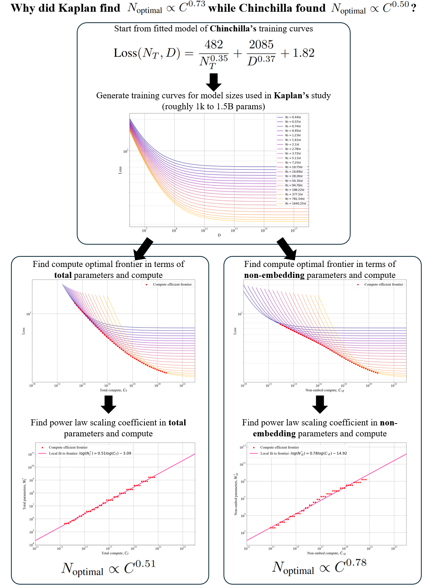

# Reconciling Kaplan and Chinchilla Scaling Laws
Code from TMLR 2024 paper 'Reconciling Kaplan and Chinchilla Scaling Laws' - [https://arxiv.org/abs/2406.12907](https://arxiv.org/abs/2406.12907) 

## Code
[```script_analysis_kaplan_chinchilla.py```](script_analysis_kaplan_chinchilla.py) is a single self-contained script for the analysis portion of the paper.  
We do not provide code for the small-scale experiments.



## Citation
```
@inproceedings{Pearce2024reconciling,
  author = {Tim Pearce and Jinyeop Song},
  title = {Reconciling Kaplan and Chinchilla Scaling Laws},
  booktitle = {TMLR},
  year = {2024}
}
```
